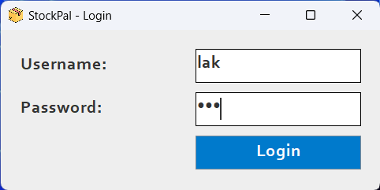
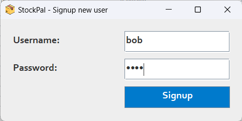
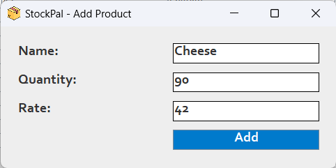
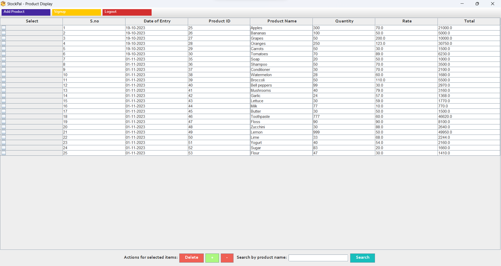

# Inventory Management System

## Overview

This Inventory Management System is a Java-based desktop application that helps manage products in a store or warehouse. It provides essential functionalities such as adding, deleting, updating, and displaying products. The application uses **Java Swing** for the user interface, **AWT** for event handling, and **MySQL** for database management.

## Features

- **User Authentication**: Allows users to sign up and log in with their credentials.
- **Add Product**: Add new products with a name, quantity, and price.
- **Delete Product**: Remove products from the inventory using their unique ID.
- **Update Product Quantity**: Update the quantity of a product.
- **Display Products**: List all products available in the inventory.

## Technology Stack

- **Java**: Core language for building the application logic.
- **Swing & AWT**: Used for creating the graphical user interface (GUI).
- **MySQL**: Database management for storing user credentials and product details.
- **JDBC**: Java Database Connectivity to interact with the MySQL database.

## Screenshots

### 1. Login Screen

### 2. Sign Up Screen

### 3. Add Product

### 4. Product List

## Prerequisites

Before running the project, ensure you have the following installed:

- **Java Development Kit (JDK)**: [Download JDK](https://www.oracle.com/java/technologies/javase-downloads.html)
- **MySQL Server**: [Download MySQL](https://dev.mysql.com/downloads/)
- **MySQL Connector/J**: [Download Connector/J](https://dev.mysql.com/downloads/connector/j/) (add it to your classpath)

## Contributions

Contributions are always welcome! Please feel free to submit a Pull Request.
